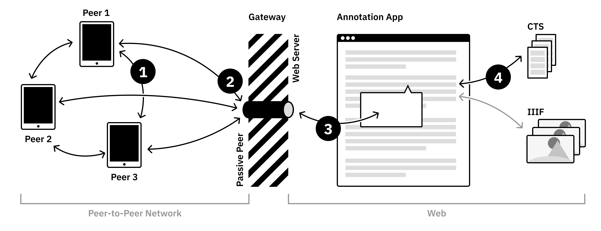

# Hyperwell Gateway

Proof-of-contept implementation of a peer-to-peer (P2P) system that leverages collaboration, local-first principles, and more on [W3C Web Annotations](https://www.w3.org/TR/annotation-model/). The system provides software for local nodes that store annotations, as well as a gateway server that implements the [Web Annotation Protocol](https://www.w3.org/TR/annotation-protocol/).

For establishing an environment of [local-first applications](https://www.inkandswitch.com/local-first.html) for collaborative annotation, we store collections of annotations called **notebooks** in [Hypermerge](https://github.com/automerge/hypermerge) documents. These documents are distributed via the [hyperswarm](https://github.com/hyperswarm/hyperswarm) decentralized network and merged without conflicts via [automerge](https://github.com/automerge/automerge).

The Hyperwell gateway aims to bridge the decentralized network and the web, offering collaborative annotation to Linked Data systems and web-based annotation environments alike by implementing the W3C Web Annotation specifications. For users, the gateway aims to offer institutional affiliation and archiving.

We laid out the motivation behind the decentralized annotation architecture of Hyperwell in our 2020 paper, [‘From Me to You: Peer-to-Peer Collaboration with Linked Data‘](https://zenodo.org/record/3750243). For more on Hyperwell and the journey behind it: https://kassel.works/hyperwell

**Important**: This is alpha software for research. Your annotations will be available publicly and accessible without authentication. This software has not been professionally audited.

## Usage

Run a gateway server via `npm start` or `./bin/server.js`. The CLI accepts the following arguments:

- `--port <number>` (`-p`): The port number to listen on. Defaults to `3000`. Example: `--port 8080`.
- `--host <hostname>`: The public hostname. Defaults to `localhost:3000`. Example: `--host www.example.com:8080`
- `--ssl` (`-s`): Whether the gateway is served via SSL. This will not make the gateway actually terminate HTTPS requests (it listens for standard HTTP requests), but will transform annotation IDs accordingly, using the `https:` scheme. Defaults to `false` (not set).

## API

The gateway exposes an web-based API as a superset of the [Web Annotation Protocol](https://www.w3.org/TR/annotation-protocol/), including support for batch operations as well as subscribing to real-time updates on notebooks via the WebSocket protocol. In the following, the `<notebook>` identifier corresponds to the notion of [‘containers’](https://www.w3.org/TR/ldp/#ldpc) on the LDP. We simply use a hexadecimal encoding of the respective Hypermerge document URL (`hypermerge://abc123...`) for URL safety. `<annotation>` corresponds to the ID of an annotation within a notebook, which commonly is a [UUID](https://tools.ietf.org/html/rfc4122) string.

- `/annotations/<notebook>`. REST endpoint for operations on an entire notebook. This endpoint supports retrieval of all of its annotations (`GET`) and creation of new a new annotation (`POST`).
- `/annotations/<notebook>/<annotation>`. REST endpoint for operations on a particular annotation within a notebook. This endpoint supports retrieval (`GET`), editing (`PUT`), and deletion (`DELETE`).
- `/annotations/batch/<notebook>`. REST endpoint for batch operations on a notebook. This endpoint supports batch creation (`POST`), batch edits (`PUT`), and batch deletions (`DELETE`).
- `/annotations/subscribe/<notebook>`. WebSocket endpoint for subscribing to changes on a notebook. Upon initiating a connection via the standard WebSocket protocol, the gateway will send messages as soon as the respective notebooks receives changes.

(tbc).

## License

[MIT License](/LICENSE), see `./LICENSE`.
